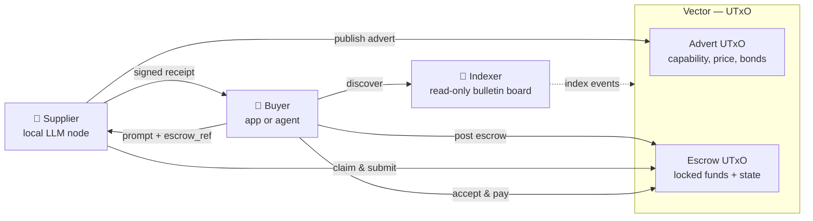
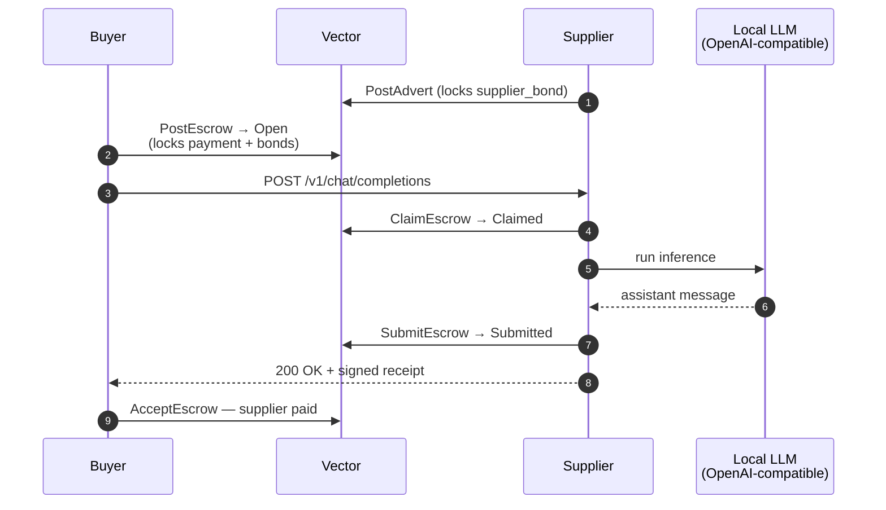
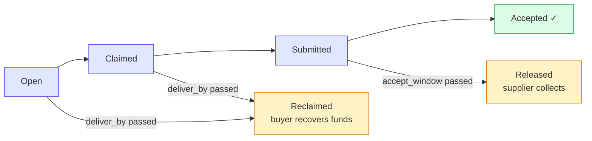

<!--
  EXECUTIVE_SUMMARY.md — slide-style overview of the Local Agents Marketplace.
  Build PDF + PPTX with: bash docs/build-deck.sh
  Edit this file; mermaid blocks are pre-rendered to docs/img/diagram-*.png.
-->

<!-- _class: title -->

# Local Agents Marketplace

### A trust-minimised, on-chain marketplace for LLM inference

Buy and sell prompt → response with **bonded escrow** on **Vector** (UTxO).
No platform fee. No central rate-limiter. Verifiable receipts on chain.

> *Status: M1 lifecycle proven end-to-end on Vector testnet — 2026-05-05.*

---

## The problem

* AI inference is **centralised** — a handful of providers, opaque pricing, account-level rate limits.
* Local-AI hardware is **idle most of the time** — GPUs and CPUs sit unused between user prompts.
* Buyers and sellers can't transact directly without a **trusted intermediary** taking a cut.
* "Verifiable" claims about which model ran are usually nothing more than the provider's word.

We need a **two-sided marketplace** where:
1. Sellers monetise spare compute,
2. Buyers get a **cryptographic receipt** of what was actually computed,
3. **Neither side has to trust the other** — bonds + on-chain settlement enforce honesty.

---

## How it works — three actors, one chain

* **Supplier** runs the inference and publishes a price.
* **Buyer** posts the work as a bonded escrow, sends the prompt, accepts the receipt.
* **Indexer** is a public mirror of chain state — anyone can run one. No platform middleman.

---

## The bonded-escrow lifecycle

Every transition is on-chain, validated by an Aiken Plutus V3 script. The receipt is signed by the supplier's advert key; prompt and response hashes are bound on chain.

---

## What if someone misbehaves?

| Failure mode | Recovery | Loss bearer |
|---|---|---|
| Supplier never claims/submits | Buyer **Reclaim** after `deliver_by` | Supplier — forfeits supplier_bond |
| Buyer disappears after Submit | Supplier **Release** after `submitted_at + 10 min` | Buyer — forfeits buyer_bond |

Bonds make honesty cheaper than running away. Both sides have skin in the game; no third-party arbiter is needed for the M1 happy/timeout paths.

---

## Local-agent versatility — any OpenAI-compatible engine

  💼 Buyer →
  🧠 Supplier (OpenAI-compatible HTTP wrapper) →
  backend ↓

  
Ollama <small>local model runner</small>

  
vLLM <small>high-throughput GPU</small>

  
llama.cpp <small>CPU · Metal · ROCm</small>

  
OpenRouter <small>cloud API mux</small>

  
openclaw / custom <small>arbitrary stack</small>

  
… <small>any OpenAI-shaped API</small>

The supplier service is a thin HTTP wrapper — it forwards `/v1/chat/completions` to whatever backend is configured. Each supplier picks its own model, hardware, and engine, then advertises a `capability_id`. Buyers shop on capability + model + price.

---

## Capability + model = task selection

| Capability ID | Example models | Use case |
|---|---|---|
| `llm.text.generate.v1` | Llama 3 · Qwen 2.5 · Mistral · GPT-4 | Q&A, drafts, summarisation |
| `code.completion.v1` | Codestral · DeepSeek-Coder · StarCoder | IDE tab-complete, refactor |
| `vision.describe.v1` | LLaVA · Qwen-VL · Pixtral | Image captioning, OCR |
| `embedding.text.v1` | nomic-embed · BGE · ada-002 | RAG indexing |
| `audio.transcribe.v1` | whisper-large-v3 · distil-whisper | Voice-to-text |
| `…` | … | … |

* New capabilities = **just publish a new advert**. No marketplace governance gate.
* Today's deploy uses Ollama + Qwen 2.5; switching to vLLM with Llama 3 70B is a config change, not a code change.

---

## OpenClaw — agentic teams on your existing OpenAI seat

  🧠 Supplier wrapper →
  🦾 OpenClaw →
  🪪 OpenAI ChatGPT seat (flat-rate)

* **Cost-efficient by default.** OpenClaw exposes your existing **OpenAI ChatGPT subscription** as an OpenAI-compatible API. The marketplace supplier dispatches its inference against it, so an entire **agentic team** (coders, QA automation testers, release curators…) draws from the **flat-rate seat you already pay for** — no per-token metering, no surprise invoices.
* **Reliability layer (optional, marginal cost).** OpenClaw can fall back to the **Anthropic API** or **OpenRouter** model pool when the primary seat is rate-limited, the prompt requires a different model, or you want a **second-layer hardening** of responses (e.g. cross-provider consensus on critical outputs). You only pay metered tokens for the requests that actually fall through.

---

## Proven on Vector testnet — 2026-05-05

| Step | Tx hash |
|---|---|
| Buyer posts escrow | `af762561…c2f7bc5` |
| Supplier claims | (lifecycle tx) |
| Supplier submits receipt | (lifecycle tx) |
| Buyer accepts | `125e3cfe…7dc100d` |

Funds flowed correctly: supplier received `payment + supplier_bond` (3 ADA); buyer got `buyer_bond` back.

* **Browser demo:** https://mp-buyers.vector.testnet.apexfusion.org
* **Live event stream:** https://mp-indexer.vector.testnet.apexfusion.org
* **Test suite:** 1098 unit tests passing, full lifecycle exercised in CI.

---

## Why UTxO + Vector

* **Bonded escrow is native** — Plutus validators enforce the state machine without a custom token or oracle.
* **Vector settles in seconds** — the buyer→claim→submit→accept loop fits inside a single chat-completion's wall clock.
* **AP3X token** for fees and bonds — fungible, transparent, on-chain.
* **No custom rollup, no bridge** — runs on a production chain today.

---

<!-- _class: closing -->

## The pitch in one sentence

> Local Agents Marketplace turns any OpenAI-compatible inference endpoint into a **trustlessly billable service** — buyer and supplier exchange prompt, response, and payment with on-chain proof that what was paid for is what was delivered.

### Try it

* **Indexer (live event stream):** https://mp-indexer.vector.testnet.apexfusion.org
* **Buyer:** https://mp-buyers.vector.testnet.apexfusion.org
* **Supplier:** https://mp-suppliers.vector.testnet.apexfusion.org/capability
